**[Assignment 1]{.underline}**

1\. Write a Verilog code for a half adder adder using data flow
abstraction and verify   using test bench

**[CODE:]{.underline}**

> module halfadder(a,b,sum,carry);
>
> input a, b;
>
> output sum, carry;
>
> assign sum = a \^ b;
>
> assign carry = a & b;
>
> endmodule

**[TESTBENCH:]{.underline}**

module half_adder_tb;

reg a,b;

wire sum,carry;

half_adder dut(a,b,sum,carry);

initial

begin

\$display(\"Testing Half Adder\");

// Test Case 1

a = 0; b = 0;

#10 \$display(\"Case 1: a=%b, b=%b, Sum=%b, Carry=%b\", a, b, sum,
carry);

// Test Case 2

a = 0; b = 1;

#10 \$display(\"Case 2: a=%b, b=%b, Sum=%b, Carry=%b\", a, b, sum,
carry);

// Test Case 3

a = 1; b = 0;

#10 \$display(\"Case 3: a=%b, b=%b, Sum=%b, Carry=%b\", a, b, sum,
carry);

// Test Case 4

a = 1; b = 1;

#10 \$display(\"Case 4: a=%b, b=%b, Sum=%b, Carry=%b\", a, b, sum,
carry);

// Stop simulation

#10 \$finish;

end

endmodule

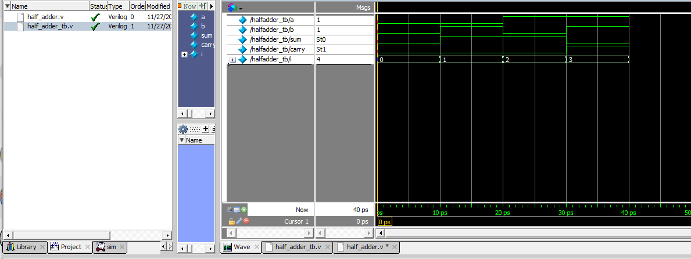{width="6.364583333333333in"
height="3.0104166666666665in"}

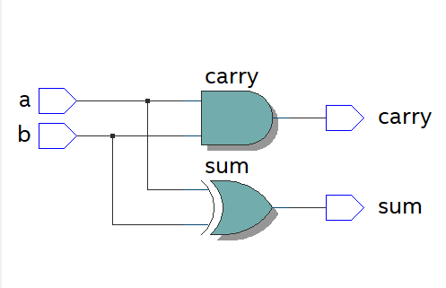{width="6.375in" height="3.34375in"}

**2. Write a Verilog for a 1 bit full adder using 2 half adder and 1 or
gate and verify   using test bench**

**CODE:**

module half_adder(a,b,sum,carry);

input a,b;

output sum,carry;

//Understand the Data-flow abstraction

assign sum = a \^ b;

assign carry = a & b;

endmodule

module full_adder(a_in,b_in,c_in,sum_out,carry_out);

input a_in,b_in,c_in;

output sum_out,carry_out;

wire w1,w2,w3;

half_adder HA1(.a(a_in),.b(b_in),.sum(w1),.carry(w2));

half_adder HA2(.a(w1),.b(c_in),.sum(sum_out),.carry(w3)); or
or1(carry_out,w3,w2);

endmodule

**[TESTBENCH:]{.underline}**

module full_adder_tb;

reg a,b,cin;

wire sum,carry;

integer i;

full_adder DUT(a,b,cin,sum,carry);

initial

begin

a = 1\'b0;

b = 1\'b0;

cin = 1\'b0;

end

initial

begin

for(i=0;i\<8;i=i+1)

begin

{a,b,cin}=i;

#10;

end

end

initial

\$monitor(\"Input a=%b, b=%b, c=%b, Output sum =%b,
carry=%b\",a,b,cin,sum,carry);

initial

#100 \$finish;

endmodule

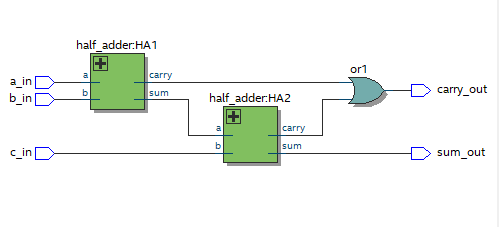{width="6.46875in" height="1.65625in"}

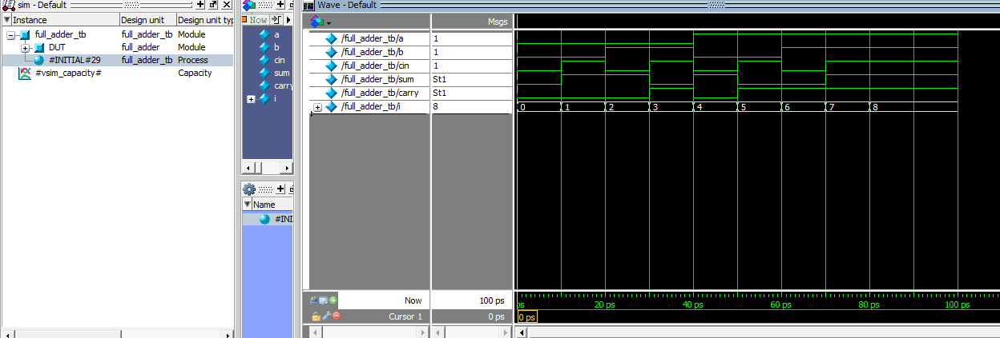{width="6.5in" height="1.8020833333333333in"}

**3. Write a verilog code  for a full  adder adder using data flow
abstraction and verify   using testbench**

**[CODE:]{.underline}**

module full_adder2(a,b,c,sum,carry);

input a,b,c;

output sum,carry;

assign sum=a\^b\^c;

assign carry=(a&b)\|(b&c)\|(a&c);

endmodule

**[TESTBENCH]{.underline}**

module full_adder2_tb;

reg a,b,c;

wire sum,carry;

integer i;

full_adder2 dut(a,b,c,sum,carry);

initial

begin

a=1\'b0;b=1\'b0;c=1\'b0;

end

initial

begin

for(i=0;i\<8;i=i+1)

begin

{a,b,c}=i;

#10;

end

end

endmodule

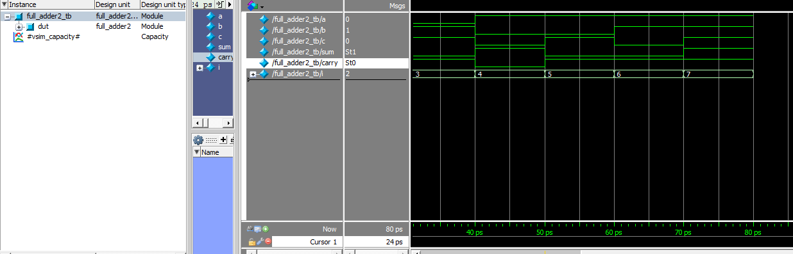{width="6.71875in" height="3.8333333333333335in"}

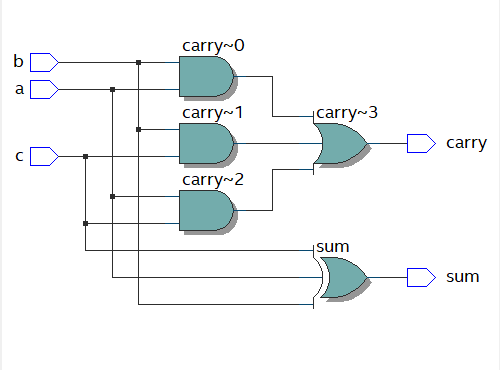{width="6.75in" height="3.8541666666666665in"}

**4. Write an RTL and test bench for 2:4 decoder using data flow
abstraction**

**[CODE:]{.underline}**

module decoder_2_4(input enable, input \[1:0\] in, output \[3:0\] out);

assign out\[0\] = (in == 2\'b00) ? enable : 1\'b0;

assign out\[1\] = (in == 2\'b01) ? enable : 1\'b0;

assign out\[2\] = (in == 2\'b10) ? enable : 1\'b0;

assign out\[3\] = (in == 2\'b11) ? enable : 1\'b0;

endmodule

**[TESTBENCH:]{.underline}**

module decoder_2_4_tb;

reg enable;

reg\[1:0\]in;

wire \[3:0\]out;

integer i;

decoder_2_4 dut(enable,in,out);

initial

begin

enable=1\'b0;

in\[0\]=1\'b0;

in\[1\]=1\'b1;

end

initial

begin

enable=1\'b1;

for(i=0;i\<4;i=i+1)

begin

{in\[0\],in\[1\]}=i;

#10;

end

end

endmodule

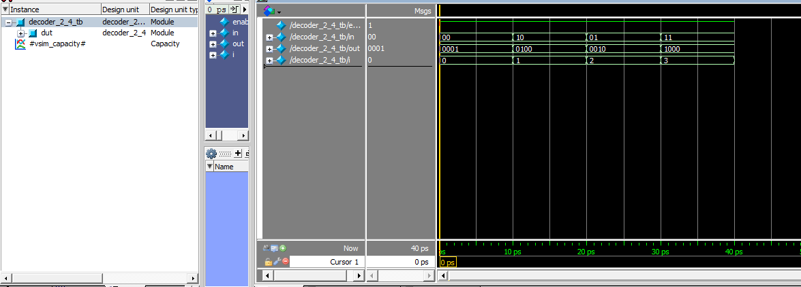{width="6.697916666666667in"
height="3.6354166666666665in"}

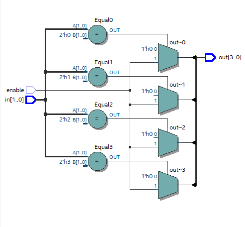{width="6.6875in" height="4.09375in"}

**5. Write an RTL and test bench for a 4:1 MUX using 2:1 MUX**

**[CODE:]{.underline}**

module mux_4_1(input \[1:0\]sel,input \[3:0\]in,output out);

wire out1,out2;

mux_2_1 i1(.a(in\[0\]),.b(in\[1\]),.sel(sel\[0\]),.out(out1));

mux_2_1 i2(.a(in\[2\]),.b(in\[3\]),.sel(sel\[0\]),.out(out2));

mux_2_1 i3(.a(out1),.b(out2),.sel(sel\[1\]),.out(out));

endmodule

**[TESTBENCH:]{.underline}**

module mux_4_1_tb;

reg \[1:0\]sel;

reg \[3:0\]in;

wire out;

integer i;

mux_4_1 i1(sel,in,out);

initial

begin

sel=2\'b00;

in=4\'b0000;

end

initial

begin

for(i=0;i\<64;i=i+1)

begin

{sel,in}=i;

#10;

end

end

endmodule

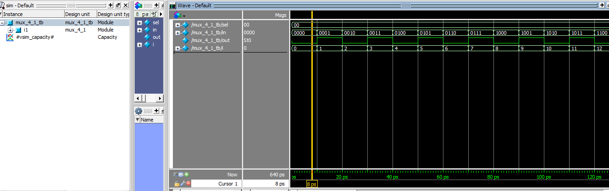{width="7.020833333333333in"
height="3.1666666666666665in"}

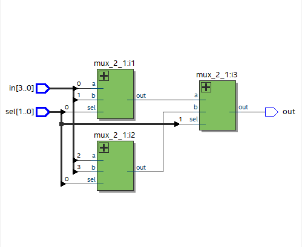{width="6.979166666666667in"
height="4.260416666666667in"}

6\. Write an RTL for a bidirectional buffer and verify the same using
test bench.

CODE:

module bi_dir_buf(send_data,recv_data,data_to_buffer);

input send_data,recv_data;

output\[2:0\] data_to_buffer;

wire \[2:0\]data_to_buffer;

wire \[2:0\] temp;

assign temp=recv_data?data_to_buffer:3\'bzzz;

assign data_to_buffer=send_data?temp:data_to_buffer;

endmodule

TESTBENCH:

module bi_dir_buf_tb;

// Inputs

reg send_data, recv_data;

// Outputs

wire \[2:0\] data_to_buffer;

// Instantiate the bidirectional buffer module

bi_dir_buf uut (

.send_data(send_data),

.recv_data(recv_data),

.data_to_buffer(data_to_buffer)

);

// Testbench stimulus

initial begin

\$display(\"Testing Bidirectional Buffer\");

// Test Case 1 (Send data)

send_data = 1; recv_data = 0;

#10 \$display(\"Case 1: send_data=%b, recv_data=%b, data_to_buffer=%b\",
send_data, recv_data, data_to_buffer);

// Test Case 2 (Receive data)

send_data = 0; recv_data = 1;

#10 \$display(\"Case 2: send_data=%b, recv_data=%b, data_to_buffer=%b\",
send_data, recv_data, data_to_buffer);

// Test Case 3 (No data transfer)

send_data = 0; recv_data = 0;

#10 \$display(\"Case 3: send_data=%b, recv_data=%b, data_to_buffer=%b\",
send_data, recv_data, data_to_buffer);

// Stop simulation

#10 \$finish;

end

endmodule

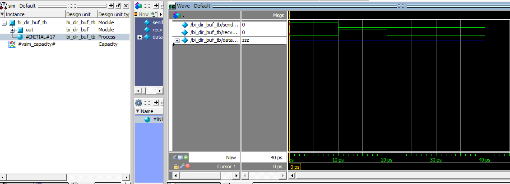{width="6.791666666666667in"
height="2.5729166666666665in"}

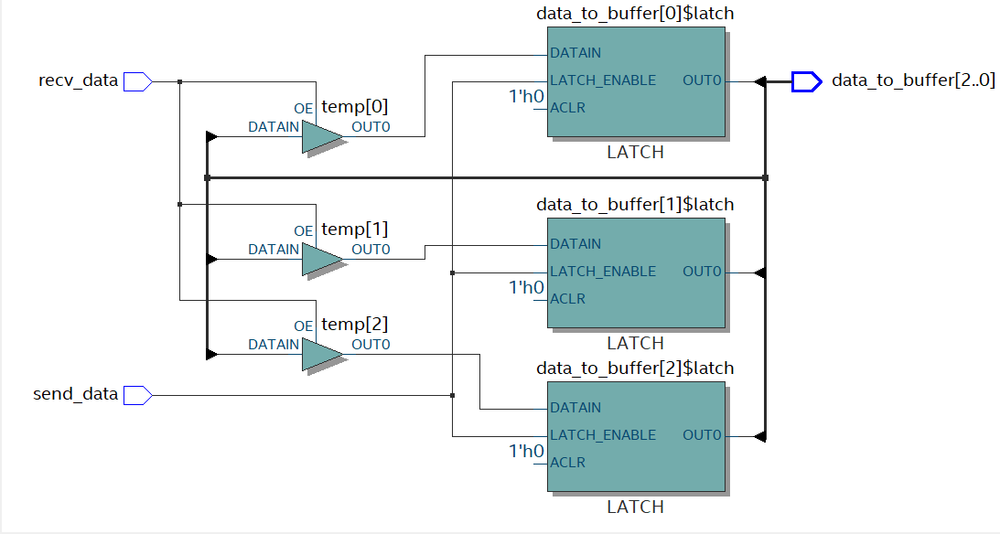{width="6.5in" height="3.472916666666667in"}

**7. Write an RTL and test bench and test bench for a 4 bit Ripple carry
adder using 1 bit   full adder**

**[CODE:]{.underline}**

module full_adder(a,b,c,sum,carry);

input a,b,c;

output sum,carry;

assign sum=a\^b\^c;

assign carry=(a&b)\|(a&c)\|(b&c);

endmodule

module ripple_carry(input \[3:0\]A,input \[3:0\]B,input CIN,output
\[3:0\]SUM,output CARRY);

wire C1,C2,C3;

full_adder i1(A\[0\],B\[0\],CIN,SUM\[0\],C1);

full_adder i2(A\[1\],B\[1\],C1,SUM\[1\],C2);

full_adder i3(A\[2\],B\[2\],C2,SUM\[2\],C3);

full_adder i4(A\[3\],B\[3\],C3,SUM\[3\],CARRY);

endmodule

**[TESTBENCH:]{.underline}**

module ripple_carry_tb;

reg \[3:0\]A;

reg \[3:0\]B;

reg CIN;

wire SUM,CARRY;

integer i;

ripple_carry dut(A,B,CIN,SUM,CARRY);

initial

begin

A=3\'b000;

B=3\'b000;

CIN=1\'b0;

end

initial

begin

for(i=0;i\<128;i=i+1)

begin

{A,B,CIN}=i;

#10;

end

end

endmodule

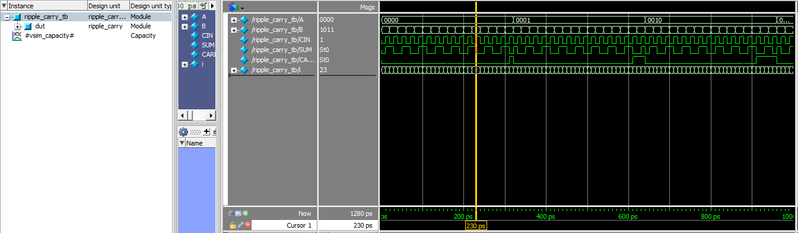{width="6.5in" height="3.0in"}

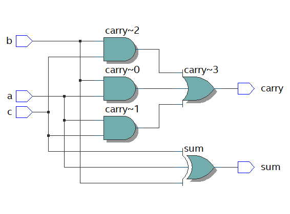{width="6.479166666666667in"
height="3.9791666666666665in"}

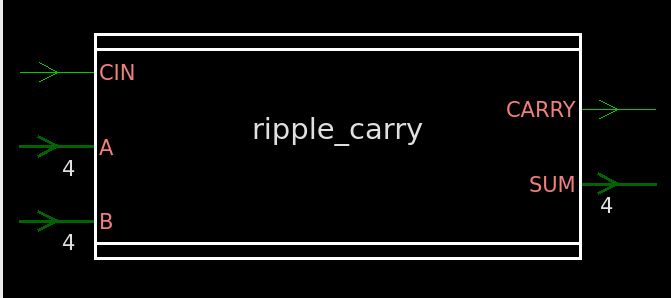{width="6.5in" height="2.8868055555555556in"}

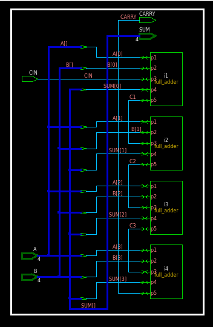{width="3.6666666666666665in"
height="5.614583333333333in"}

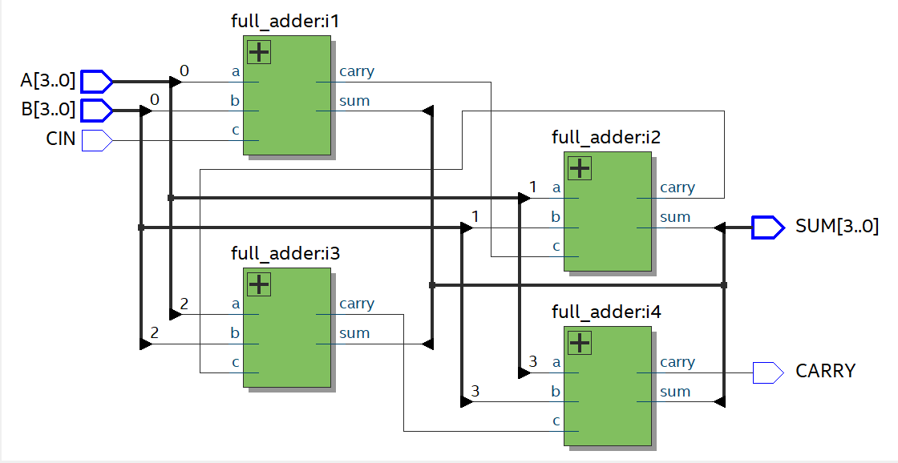{width="6.5in" height="3.9270833333333335in"}

**8. Write an RTL for 4X1 mux using decoder and tri state buffer and
verify the same    using test bench**

**[CODE:]{.underline}**

module buffer(in,control,out);

input in,control;

output out;

assign out=(control==1)?in:out;

endmodule

module decoder(input \[1:0\]in,output \[3:0\]out);

assign out\[0\]=(in==2\'b00)?1\'b1:1\'b0;

assign out\[1\]=(in==2\'b01)?1\'b1:1\'b0;

assign out\[2\]=(in==2\'b10)?1\'b1:1\'b0;

assign out\[3\]=(in==2\'b11)?1\'b1:1\'b0;

endmodule

module mux_4_dec_buf(input \[3:0\]IN,input \[1:0\]SEL, output OUT);

wire \[3:0\]C;

wire \[3:0\]ot;

decoder d1(SEL,C);

buffer i1(IN\[0\],C\[0\],ot\[0\]);

buffer i2(IN\[1\],C\[1\],ot\[1\]);

buffer i3(IN\[2\],C\[2\],ot\[2\]);

buffer i4(IN\[3\],C\[3\],ot\[3\]);

assign OUT=(SEL==2\'b00)?ot\[0\]:

(SEL==2\'b01)?ot\[1\]:

(SEL==2\'b10)?ot\[2\]:

(SEL==2\'b11)?ot\[3\]:4\'b0000;

endmodule

**[TESTBENCH:]{.underline}**

module mux_4_dec_buf_tb;

reg \[1:0\]sel;

reg \[3:0\]in;

wire out;

integer i;

mux_4_dec_buf i1(in,sel,out);

initial

begin

sel=2\'b00;

in=4\'b0000;

end

initial

begin

for(i=0;i\<64;i=i+1)

begin

{sel,in}=i;

#10;

end

end

endmodule

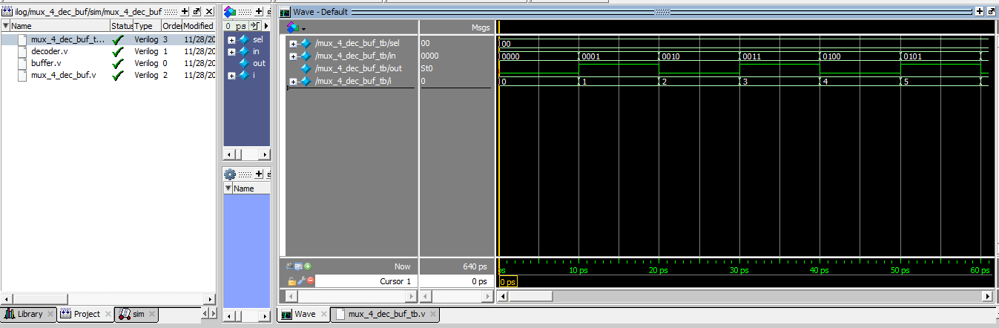{width="7.072916666666667in" height="2.34375in"}

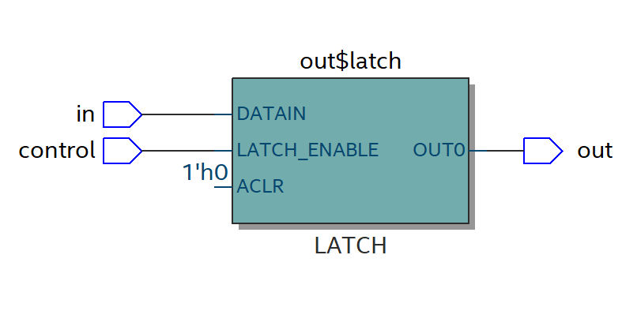{width="6.5in" height="3.411111111111111in"}

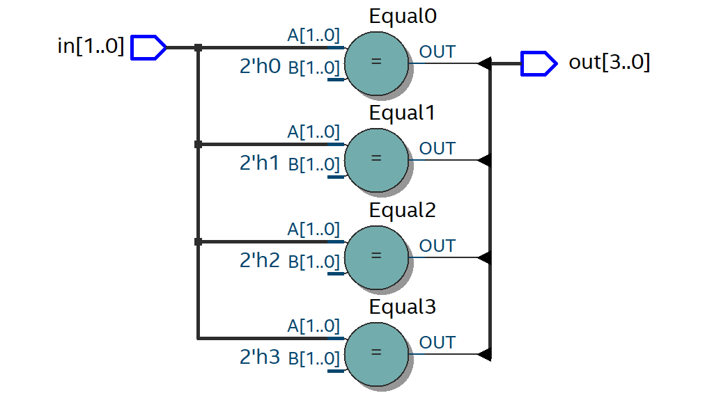{width="6.5in" height="3.6930555555555555in"}

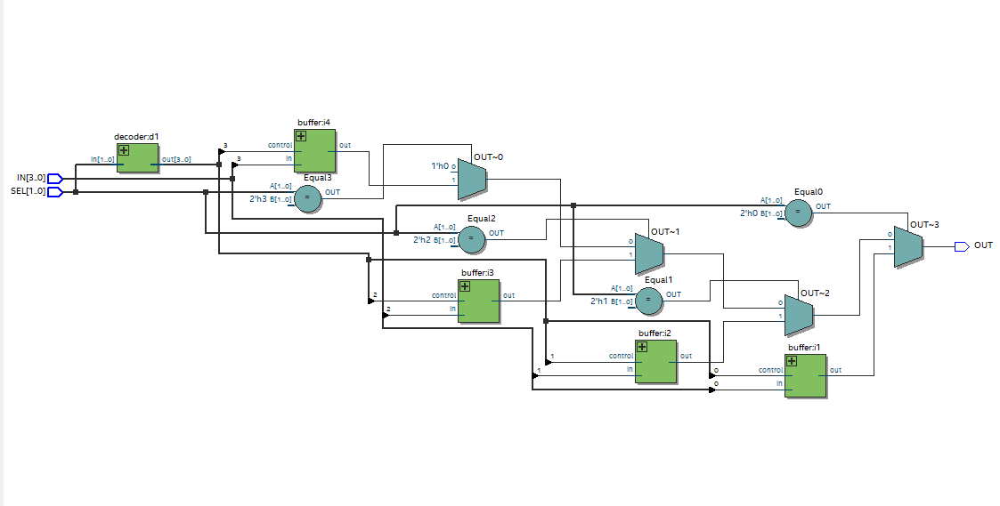{width="6.5in" height="3.29375in"}

9\. write 8:3 priority  encoder using a structural model.

CODE:

module prio_encoder_8_3(input \[7:0\] in, output \[2:0\] out);

assign out = (in\[7\]) ? 3\'b111 :

(in\[6\]) ? 3\'b110 :

(in\[5\]) ? 3\'b101 :

(in\[4\]) ? 3\'b100 :

(in\[3\]) ? 3\'b011 :

(in\[2\]) ? 3\'b010 :

(in\[1\]) ? 3\'b001 :

3\'b000;

endmodule

TESTBENCH:\
module prio_encoder_8_3_tb;

reg \[7:0\]IN;

wire \[2:0\]OUT;

integer i;

prio_encoder_8_3 dut(IN,OUT);

initial

begin

IN=8\'b0000_0000;

end

initial

begin

for(i=0;i\<256;i=i+1)

begin

IN=i;

#10;

end

end

endmodule

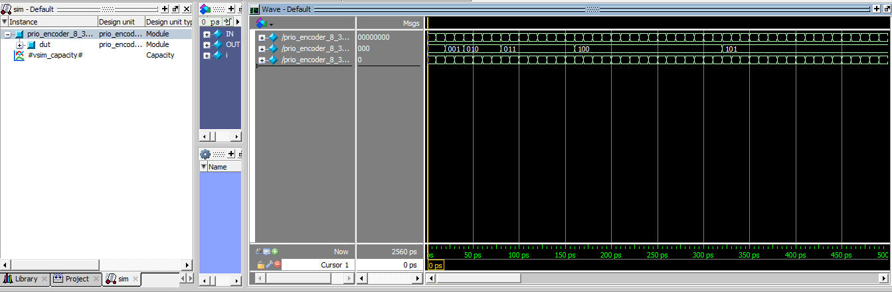{width="6.5in" height="4.125in"}

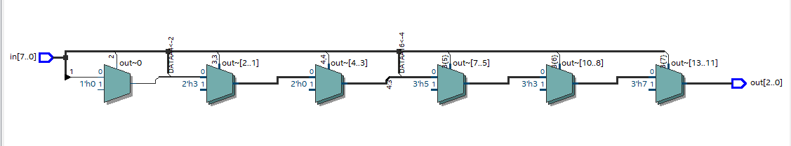{width="6.5in" height="3.7916666666666665in"}
